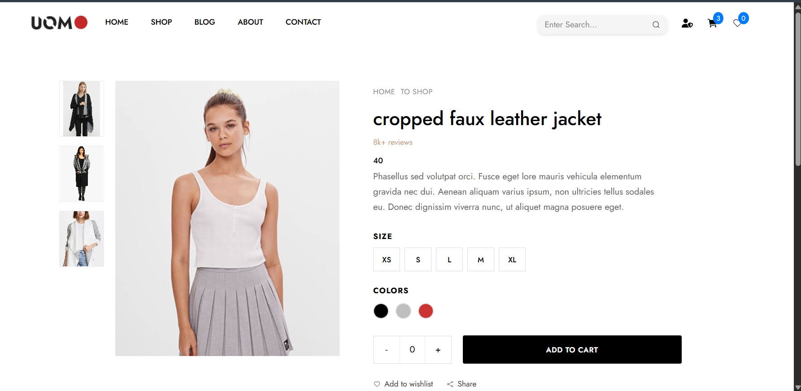
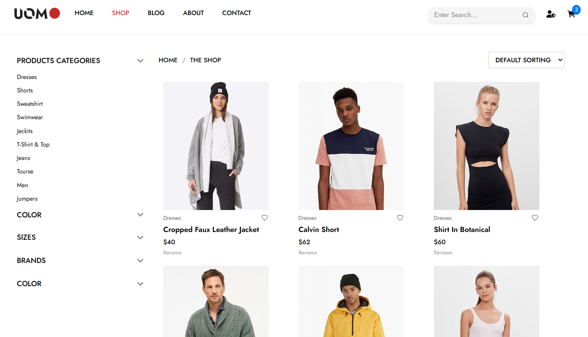
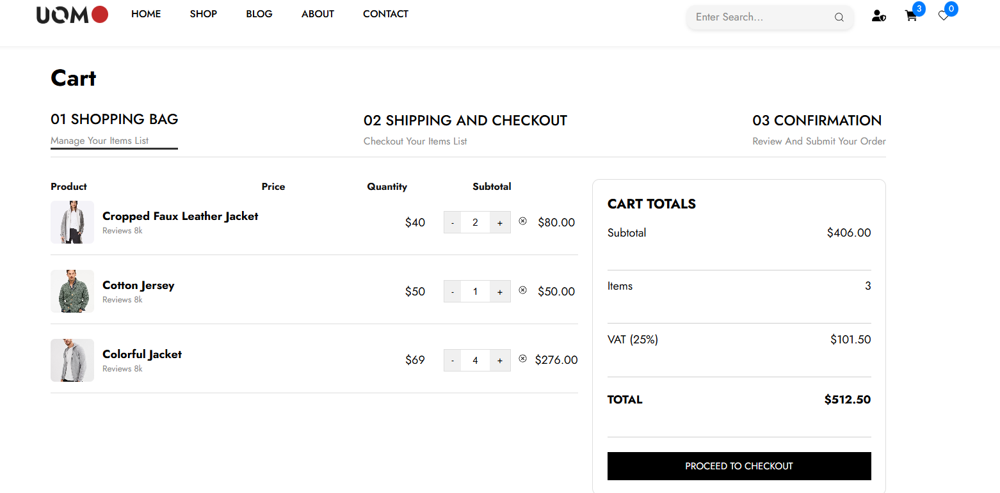

# 🛒 Pro-Cart E-commerce (React)

A feature-rich e-commerce store built with **React** and **Context API** for seamless state management. 🚀

## ✨ Key Features

- **📦 Product Management:** Browse products with dynamic filtering.
- **🛒 Shopping Cart:** Add, remove, and update quantities in real-time.
- **❤️ Wishlist:** Save your favorite items for later.
- **💳 Checkout Flow:** Integrated checkout logic with form validation.
- **📱 Responsive:** Fully optimized for all screen sizes.

## 🛠️ Tech Stack

- **Library:** React.js ⚛️
- **State Management:** Context API & useReducer 🧠
- **Styling:** Tailwind CSS 🌊
- **Icons:** React Icons

## 📸 Project Preview

## 💡 Technical Insight

Used **Context API** to avoid prop-drilling, making the cart state accessible globally. This ensures a smooth sync between the product list, wishlist, and cart.
